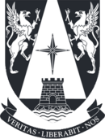

# MIA_ComputerVision 
 
Repositorio creado para el Curso de Visión Artificial (_Computer Vision_) en el programa de Magister en Inteligencia Artificial de la Universidad Adolfo Ibáñez

**Eduardo Carrasco Vidal**

[Link de Acceso al Notebook](https://github.com/educarrascov/MIA_ArtificialVision/blob/main/Prueba_Vision_artificial.ipynb), de la **prueba final de Visión Artificial**.

 

## Contiene los siguientes Script:

Link al desarrollo en Clases:

[Ejemplo para tarea](https://github.com/educarrascov/MIA_ArtificialVision/blob/main/MIA_ArtificialVision_(Clase_2).ipynb)

1. [Script Lectura](https://github.com/educarrascov/MIA_ArtificialVision/blob/main/Script/01_lectura.py).
2. [Script bgr a brg](https://github.com/educarrascov/MIA_ArtificialVision/blob/main/Script/02_bgr_a_rgb.py).
3. [Script Separación canales](https://github.com/educarrascov/MIA_ArtificialVision/blob/main/Script/03_separacion_canales.py).
4. [Script Histogramas](https://github.com/educarrascov/MIA_ArtificialVision/blob/main/Script/04_histogramas.py).
5. [Script Dimensiones Canales](https://github.com/educarrascov/MIA_ArtificialVision/blob/main/Script/05_dimensiones_canales.py)
6. [Script Pixel Value](https://github.com/educarrascov/MIA_ArtificialVision/blob/main/Script/06_pixel_value.py).
7. [Script Image Roi](https://github.com/educarrascov/MIA_ArtificialVision/blob/main/Script/07_image_roi.py).
8. [Script Cambio Escala](https://github.com/educarrascov/MIA_ArtificialVision/blob/main/Script/08_cambio_escala.py).
9. [Script Sub Roi](https://github.com/educarrascov/MIA_ArtificialVision/blob/main/Script/09_sub_roi.py).
10. [Script Sub Roi Valores](https://github.com/educarrascov/MIA_ArtificialVision/blob/main/Script/10_sub_roi_valores.py).
11. [Script Binarización](https://github.com/educarrascov/MIA_ArtificialVision/blob/main/Script/11_binarizacion.py).
12. [Script Valores Rango](https://github.com/educarrascov/MIA_ArtificialVision/blob/main/Script/12_valores_rango.py).
13. [Script Inverso](https://github.com/educarrascov/MIA_ArtificialVision/blob/main/Script/13_inverso.py).
14. [Script Función Gamma](https://github.com/educarrascov/MIA_ArtificialVision/blob/main/Script/14_funcion_gamma.py).
15. [Script Selección Planos](https://github.com/educarrascov/MIA_ArtificialVision/blob/main/Script/15_seleccion_planos.py)
16. [Script Ecualización](https://github.com/educarrascov/MIA_ArtificialVision/blob/main/Script/16_ecualizacion.py)
17. [Script Ecualización Colores](https://github.com/educarrascov/MIA_ArtificialVision/blob/main/Script/17_ecualizacion_colores.py)
18. [Script Especificación](https://github.com/educarrascov/MIA_ArtificialVision/blob/main/Script/18_especificacion.py)
19. [Script Suma Imagenes](https://github.com/educarrascov/MIA_ArtificialVision/blob/main/Script/19_suma_imagenes.py)
20. [Script Suma Ruido](https://github.com/educarrascov/MIA_ArtificialVision/blob/main/Script/20_suma_ruido.py)
21. [Script Suma Ponderada](https://github.com/educarrascov/MIA_ArtificialVision/blob/main/Script/21_suma_ponderada.py)
22. [Script Binarización Suavizado](https://github.com/educarrascov/MIA_ArtificialVision/blob/main/Script/22_binarizacion_suavizado.py)
23. [Script Bordes STD](https://github.com/educarrascov/MIA_ArtificialVision/blob/main/Script/23_bordes_std.py)
24. [Script Filtros Mediana](https://github.com/educarrascov/MIA_ArtificialVision/blob/main/Script/24_filtro_mediana.py)
25. [Script Reducción Ruido Mediana](https://github.com/educarrascov/MIA_ArtificialVision/blob/main/Script/25_reduccion_ruido_mediana.py)
26. [Script Bordes Roberts](https://github.com/educarrascov/MIA_ArtificialVision/blob/main/Script/26_bordes_roberts.py)
27. [Script USharp](https://github.com/educarrascov/MIA_ArtificialVision/blob/main/Script/27_usharp.py)
28. [Script Operador Sobel](https://github.com/educarrascov/MIA_ArtificialVision/blob/main/Script/28_operador_sobel.py)
29. [Script Operador Prewitt](https://github.com/educarrascov/MIA_ArtificialVision/blob/main/Script/29_operador_prewitt.py)
30. [Script Dilate](https://github.com/educarrascov/MIA_ArtificialVision/blob/main/Script/30_dilate.py)

